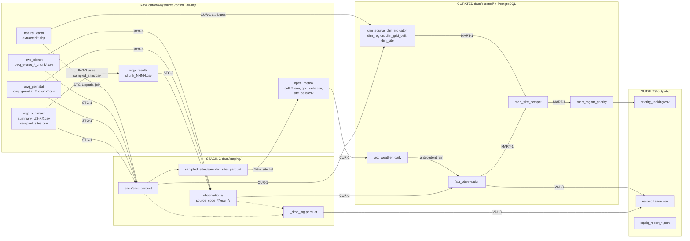

# Data Flow and Lineage
 
**Status:** Version 1.0 · **Related:** [`architecture.md`](architecture.md), [`data_dictionary.md`](data_dictionary.md), [`erd.md`](erd.md), README §5
 
How data moves from each source to the final ranking, what happens at every step, and how any curated row can be traced back to the file it came from.
 
---
 
## 1. Lineage diagram (datasets)
 

 
> README §5 links `docs/data_flow.png`. Export this diagram to PNG under that name, or point the README link to this file.
 
Note the loop: **sampling happens before the expensive pulls**. WQP results (ING-3) are only requested for the sites ING-2 sampled, and Open-Meteo (ING-4) only for the grid cells of sampled sites from all strata.
 
## 2. Step by step
 
| # | Step | Ticket / module | Run manually | Reads | Writes | Row-count control |
|---|---|---|---|---|---|---|
| 1a | Extract OWQ (GEMStat, Eionet) | ING-1 · `src/extract/owq.py` | `python -m src.extract.owq` | OWQ export endpoint | raw CSV chunks per year (split by `loc_type` if capped at 100,000 rows) | `X-Row-Count` header vs rows saved |
| 1b | Extract WQP summary + sample US sites | ING-2 · `src/extract/wqp_sites.py` | `python -m src.extract.wqp_sites` | WQP summary service, one request per state | `summary_US-XX.csv`, `sampled_sites.csv`, `sampling_summary.csv` | manifest `row_count` per file |
| 1c | Extract WQP results for sampled sites | ING-3 · `src/extract/wqp_results.py` | `python -m src.extract.wqp_results` | WQP Result service (POST, 50 sites/chunk) | `chunk_NNNN.zip` + `.csv` | manifest `row_count` per chunk |
| 1d | Extract boundaries | ING-5 · `src/extract/boundaries.py` | `python -m src.extract.boundaries` | Natural Earth zip | zip + `extracted/*.shp` | feature count (4,596 in ING-5) |
| 2 | Validate raw | VAL-1 · `src/validation/raw_checks.py` | `python -m src.validation.raw_checks --all` | every `manifest.json` | `outputs/dq/dq_report_raw_*.json`, `dq_results` | checksums, row counts |
| 3 | Build sites, assign regions, sample OWQ | STG-1 · `src/transform/sites.py` | `python -m src.transform.sites` | OWQ raw, WQP `sampled_sites.csv`, Natural Earth | `sites.parquet`, `sampled_sites.parquet`, drop log (`stage=sites`) | sampling summary per stratum × realm |
| 1e | Extract weather for sampled sites | ING-4 · `src/extract/weather.py` | `python -m src.extract.weather` | `sampled_sites.parquet`, Open-Meteo archive | `cell_*.json`, `grid_cells.csv`, `site_cells.csv` | day count per cell vs period |
| 4 | Harmonize observations | STG-2 · `src/transform/staging.py` | `python -m src.transform.staging` | WQP + OWQ raw, `sampled_sites.parquet` | `observations/source_code=*/year=*/part-0000.parquet`, drop log (`stage=observations`) | `rows_in = rows_out + rows_dropped` per source, else the step fails |
| 5 | Validate staging | VAL-2 · `src/validation/staging_checks.py` | `python -m src.validation.staging_checks` | staging Parquet | `dq_report_staging_*.json` | `obs_key` unique |
| 6 | Build curated tables | CUR-1 · `src/transform/curated.py` | `python -m src.transform.curated` | staging, Open-Meteo raw, Natural Earth attributes | `data/curated/*.parquet`, `_manifest.json` | weather coverage in manifest |
| 7 | Score hotspots, rank regions | MART-1 · `src/transform/marts.py` | `python -m src.transform.marts` | curated Parquet | `mart_site_hotspot.parquet`, `mart_region_priority.parquet`, `outputs/priority_ranking.csv` | logged: sites scored, hotspots, ranked regions |
| 8 | Load warehouse | DB-1 / LOAD-1 · `src/load/` | `python -m src.load.init_db` (DDL); load: *TBD in LOAD-1* | curated Parquet | 11 PostgreSQL tables, `etl_batch_log` | UPSERT counts |
| 9 | Validate curated + reconcile | VAL-3 · `src/validation/curated_checks.py` | `python -m src.validation.curated_checks` | PostgreSQL, staging manifest + drop log | `dq_report_curated_*.json`, `outputs/reconciliation.csv` | raw − drops = staging = `fact_observation`, per source |
 
Inside Docker, prefix each command with `docker compose run --rm pipeline`. In the full run, Airflow (ING-6) calls the same `run()` / `build_*()` functions in this order.
 
## 3. What changes at each layer
 
### Raw → staging (STG-1, STG-2)
 
| Transformation | Rule | Source of the rule |
|---|---|---|
| Indicator names | Exact match after trimming, e.g. `Escherichia coli` / `E. coli` → `e_coli` | `mappings.yaml › indicator_names` |
| Units | Normalized unit → multiplier to CFU/100 mL (`#/100ml`, `mpn/100ml`, `cfu/100ml` = 1.0). Unlisted units dropped as `unit_unmapped` | `mappings.yaml › units` |
| Censoring | `<x` → x/2, `>x` → x; WQP detection-condition texts and `*Non-detect` mapped too | `mappings.yaml › censoring` |
| Filters | QC blanks, `Rejected` results, non-water media, out-of-period dates, unsampled sites removed | `mappings.yaml › filters`, `sampling.yaml › period` |
| Keys | `site_key = source_code:source_site_id`; `obs_key = source_code:source_record_id` (SHA-1 when the source has no record ID; OWQ site ID = coordinates rounded to 5 decimals) | `mappings.yaml › record_id` |
| Regions | Point-in-polygon admin-1; else nearest within 25 km; else `none` | `sites.assign_regions` |
| Realm, stratum | Water-body type → freshwater / marine / excluded; country / continent → stratum | `sampling.yaml › water_body_realm, strata` |
| Sampling | Eligible (≥ 24 primary-indicator samples, ≥ 3 years) → up to K=60 per stratum × realm, seed 42 | `sampling.yaml` |
| Drops | Every removed row is counted by reason in `_drop_log.parquet` | `mappings.yaml › drop_reasons` |
 
### Staging → curated (CUR-1)
 
| Transformation | Rule |
|---|---|
| Scope | Only `is_sampled` sites and their observations |
| Weather cell | Each site → nearest 0.25° cell centre (`cell_id`, e.g. `14.50_121.00`) |
| Antecedent weather | `rain_48h_mm` = sample day + previous day; `rain_72h_mm` adds one more day; `temp_mean_c` = sample day. Any missing day → null (never a partial sum) |
| Wet flag | `is_wet = rain_48h_mm >= 10 mm`; null if no weather |
| Exceedance | `exceeds_threshold = value_cfu_100ml > threshold` for scored indicators; null for supplementary |
 
### Curated → marts (MART-1)
 
Sample-days (shifted geometric mean of same-day replicates) → site-years (poor if > 10% of sample-days exceed, insufficient if < 5 sample-days) → sites (persistent hotspot if poor in ≥ 3 of the most recent 5 classified years) → regions (weighted, min-max normalized score; ≥ 3 sites to be ranked). Every value is in `config/business_rules.yaml`, justified in [`business_rules.md`](business_rules.md).
 
## 4. Tracing one record (lineage)
 
Any row in `fact_observation` can be followed back to its raw file:
 
```
mart_region_priority.region_code
  → dim_site.region_code            (sites in that region)
    → mart_site_hotspot.site_key    (is_persistent_hotspot)
      → fact_observation.site_key   (the observations behind it)
        → fact_observation.raw_batch_id + raw_file
          → data/raw/{source_code}/batch_id={raw_batch_id}/{raw_file}
            → manifest.json         (request URL, sha256, retrieved_at_utc)
```
 
`load_batch_id` → `etl_batch_log` shows which run loaded the row. Query Q5 in [`sql/queries.sql`](../sql/queries.sql) runs this trace for the top-ranked region (live demo).
 
## 5. Reruns and failures
 
| Situation | What happens |
|---|---|
| Rerun with the same parameters | Extractors find a complete batch (`status: success`, files intact) and make **no network call**; staging is rebuilt in a temp folder and swapped in; loads UPSERT on natural keys. Same row counts |
| Rerun with different parameters (e.g. period) | New `batch_id` → new raw folder; old batches remain for lineage |
| Interrupted extract (or Open-Meteo daily budget reached) | Manifest stays `partial`; the next run resumes from the last completed file |
| Critical DQ check fails | The validation task raises `DataQualityError` and the Airflow run stops before the next layer |
| Snapshot mode (`PIPELINE_MODE=snapshot`, default) | Any HTTP call raises `NetworkDisabledError`; the run uses the files already in `data/raw/` |
 
## 6. Volumes (fill from the final full run)
 
Copy these from real logs / `outputs/reconciliation.csv`, never estimate them.
 
| Source | Raw rows | Dropped in staging | Staging rows | `fact_observation` rows |
|---|---|---|---|---|
| `wqp` | | | | |
| `owq_gemstat` | | | | |
| `owq_eionet` | | | | |
| **Total** | | | | |
 
| Other | Value |
|---|---|
| Sampled sites (us / europe / gemstat_latin_america) | 120 / 120 / 60 = 300 ([`business_rules.md`](business_rules.md) §6) |
| Weather grid cells | |
| `fact_weather_daily` rows | |
| Persistent hotspots / sites scored | |
| Regions ranked / insufficient_sites | |
