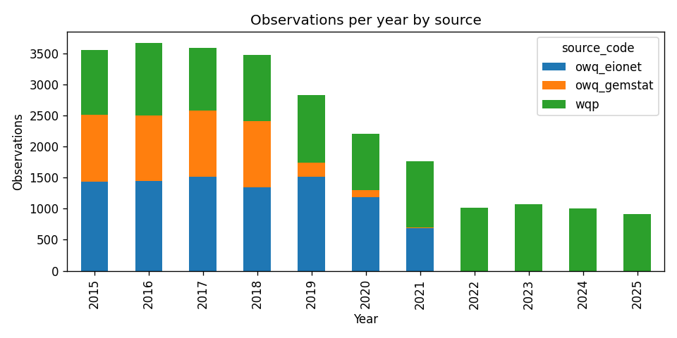
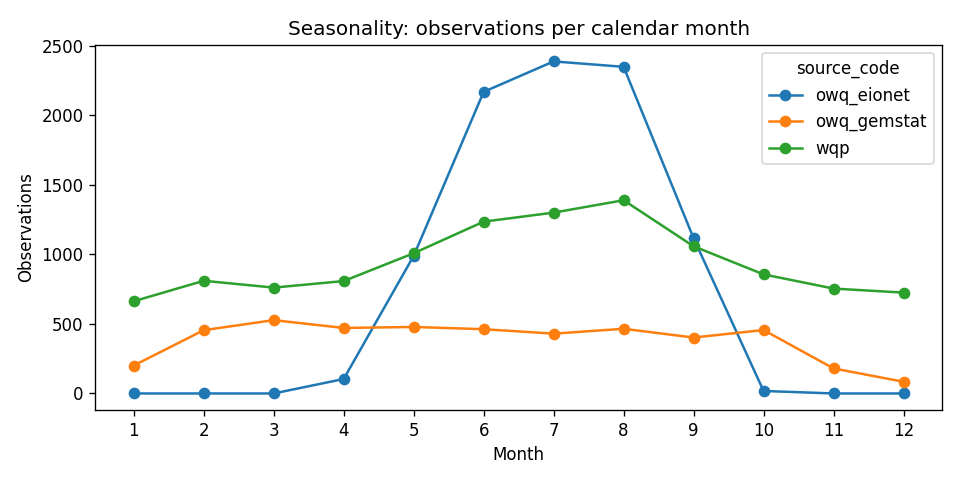
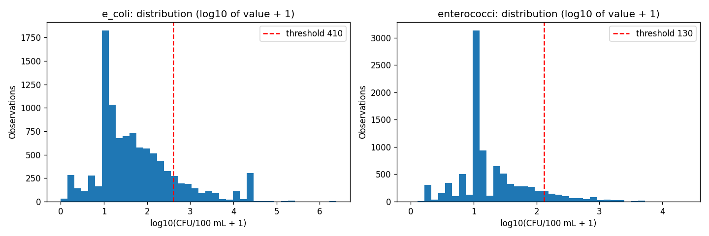
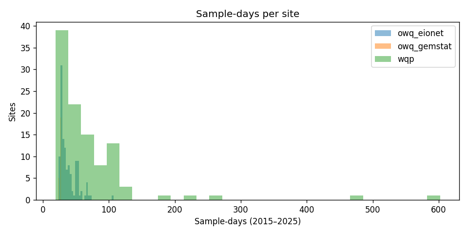
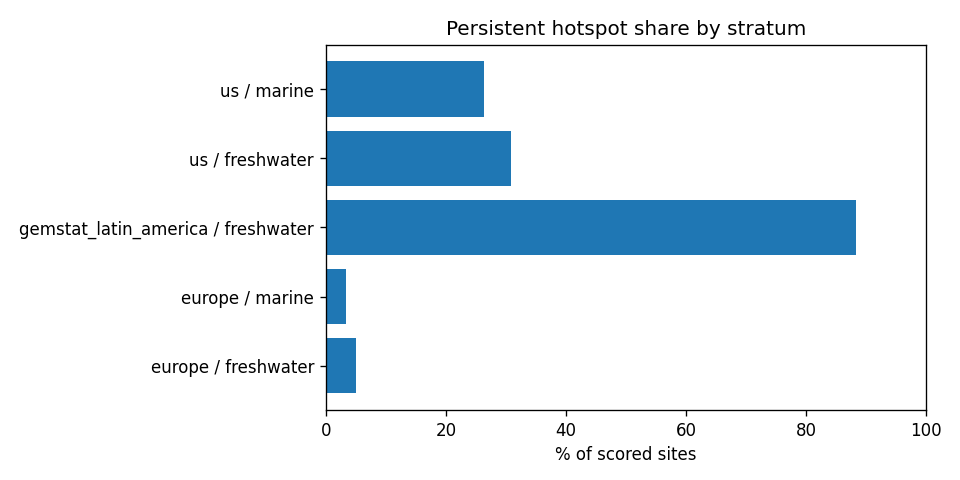

# Source Profiling and Descriptive Statistics

*Generated by `python -m src.analysis.eda` from the pipeline's current output; do not edit by hand. Staging batch `stg_observations_5df62c59b800`, period 2015–2025.*

## 1. Summary

- **25,108 harmonized observations** from **285 sites** (300 sampled) across **3 sources**.
- Dates 2015-01-05 to 2025-12-29; 3.8% of values are censored (below/above a detection limit).

## 2. Raw batches

| source | batch_id | status | files | rows | size_mb | used_by_staging |
|---|---|---|---|---|---|---|
| natural_earth | natural_earth_e47c2a7cb821 | success | 8 | 4,596 | 51.15 | no |
| open_meteo | open_meteo_1265e632620d | partial | 12 | 40,736 | 0.95 | no |
| open_meteo | open_meteo_2d6c85b88b47 | success | 5 | 12,060 | 0.28 | no |
| owq_eionet | owq_eionet_e86ef04d7716 | success | 47 | 1,085,694 | 98.13 | yes |
| owq_gemstat | owq_gemstat_cbe19092b675 | success | 45 | 263,711 | 34.82 | yes |
| wqp_results | wqp_results_8851c1786551 | success | 2 | 1,321 | 0.70 | no |
| wqp_results | wqp_results_8c80b98f221b | success | 6 | 13,240 | 7.06 | yes |
| wqp_summary | wqp_summary_9fe8e48f2a31 | success | 118 | 540,908 | 174.93 | no |

## 3. Volume by layer

| source | raw_rows_read | staging_rows | curated_rows | sampled_sites | sites_with_data | first_date | last_date |
|---|---|---|---|---|---|---|---|
| owq_eionet | 1,085,694 | 9,130 | 9,130 | 120 | 120 | 2015-04-20 | 2021-09-27 |
| owq_gemstat | 263,711 | 4,611 | 4,611 | 60 | 60 | 2015-02-02 | 2021-09-21 |
| wqp | 13,240 | 11,367 | 11,367 | 120 | 105 | 2015-01-05 | 2025-12-29 |

## 4. Observations by indicator and source

| indicator_code | owq_eionet | owq_gemstat | wqp | total |
|---|---|---|---|---|
| e_coli | 4,571 | 1,556 | 3,884 | 10,011 |
| enterococci | 4,559 | 0 | 4,672 | 9,231 |
| fecal_coliform | 0 | 1,558 | 2,590 | 4,148 |
| total_coliform | 0 | 1,497 | 221 | 1,718 |

## 5. Observations by year

| year | owq_eionet | owq_gemstat | wqp | total |
|---|---|---|---|---|
| 2015 | 1,440 | 1,072 | 1,042 | 3,554 |
| 2016 | 1,444 | 1,061 | 1,165 | 3,670 |
| 2017 | 1,512 | 1,068 | 1,015 | 3,595 |
| 2018 | 1,346 | 1,062 | 1,066 | 3,474 |
| 2019 | 1,516 | 225 | 1,092 | 2,833 |
| 2020 | 1,182 | 118 | 912 | 2,212 |
| 2021 | 690 | 5 | 1,068 | 1,763 |
| 2022 | 0 | 0 | 1,017 | 1,017 |
| 2023 | 0 | 0 | 1,073 | 1,073 |
| 2024 | 0 | 0 | 1,006 | 1,006 |
| 2025 | 0 | 0 | 911 | 911 |

## 6. Values (CFU/100 mL)

| source | indicator | n | min | p25 | median | p75 | p95 | max | geo_mean | pct_above_threshold | pct_at_lab_upper_limit | pct_censored |
|---|---|---|---|---|---|---|---|---|---|---|---|---|
| owq_eionet | e_coli | 4,571 | 0.00 | 10.00 | 15.00 | 53.00 | 270.00 | 34,660.00 | 25.18 | 2.93 | 0.09 | 0.00 |
| owq_eionet | enterococci | 4,559 | 0.00 | 10.00 | 10.00 | 20.00 | 95.00 | 10,000.00 | 14.63 | 3.36 | 0.02 | 0.00 |
| owq_gemstat | e_coli | 1,556 | 1.00 | 90.00 | 750.00 | 11,000.00 | 24,196.00 | 2,419,600.00 | 787.71 | 55.59 | 21.85 | 0.00 |
| owq_gemstat | fecal_coliform | 1,558 | 3.00 | 1,024.00 | 4,600.00 | 24,000.00 | 24,196.00 | 2,419,600.00 | 3,445.28 |  | 34.15 | 0.00 |
| owq_gemstat | total_coliform | 1,497 | 3.00 | 3,076.00 | 19,863.00 | 24,000.00 | 24,196.00 | 2,419,600.00 | 7,114.24 |  | 49.43 | 0.00 |
| wqp | e_coli | 3,884 | 0.00 | 10.00 | 41.00 | 152.00 | 1,203.30 | 141,360.00 | 47.40 | 13.70 | 1.26 | 4.89 |
| wqp | enterococci | 4,672 | 0.00 | 10.00 | 12.00 | 64.00 | 606.95 | 24,196.00 | 24.15 | 15.39 | 0.13 | 8.71 |
| wqp | fecal_coliform | 2,590 | 0.00 | 3.00 | 25.00 | 64.00 | 546.50 | 51,000.00 | 22.18 |  | 0.23 | 12.24 |
| wqp | total_coliform | 221 | 1.00 | 1,000.00 | 2,419.60 | 8,200.00 | 24,000.00 | 73,000.00 | 1,965.73 |  | 14.03 | 13.12 |

Geometric mean uses the same shift as MART-1 (exp(mean(log(v + 1))) − 1). `pct_above_threshold` uses the EPA single-sample values (scored indicators only). `pct_at_lab_upper_limit`: values exactly at a common laboratory upper reporting limit (e.g. 2,419.6 or 24,196 MPN/100 mL); these usually mean "at least this much", so true levels may be higher and severity is understated.

## 7. Sites, eligibility and sampling

| stratum | realm | candidates | eligible | sampled |
|---|---|---|---|---|
| europe | freshwater | 8,791 | 3,454 | 60 |
| europe | marine | 472 | 224 | 60 |
| gemstat_asia | freshwater | 2,067 | 0 | 0 |
| gemstat_latin_america | freshwater | 3,580 | 1,463 | 60 |
| us | freshwater | 60 | 60 | 60 |
| us | marine | 60 | 60 | 60 |

| source_code | sites | min_days | median_days | max_days | median_years |
|---|---|---|---|---|---|
| owq_eionet | 120 | 24 | 34.00 | 107 | 5.00 |
| owq_gemstat | 60 | 24 | 26.00 | 28 | 6.00 |
| wqp | 105 | 19 | 51.00 | 602 | 10.00 |

## 8. Data quality: missing values, drops, unmapped units

**Columns with missing values (staging observations):**

| column | pct_null |
|---|---|
| censor_direction | 96.24 |
| detection_limit | 75.87 |
| activity_id | 54.73 |
| result_status | 54.73 |
| activity_type | 54.73 |
| original_unit | 2.30 |
| original_value | 2.11 |

**Rows dropped after raw, by reason:**

| stage | source_code | reason | row_count |
|---|---|---|---|
| observations | owq_eionet | site_not_sampled | 1,076,564 |
| observations | owq_gemstat | site_not_sampled | 259,100 |
| observations | wqp | unit_unmapped | 1,449 |
| observations | wqp | media_not_water | 273 |
| observations | wqp | qc_blank | 108 |
| observations | wqp | non_numeric_value | 31 |
| observations | wqp | result_rejected | 12 |
| sites | owq_eionet | water_body_excluded | 18,060 |
| sites | owq_eionet | no_stratum | 67 |
| sites | owq_gemstat | no_stratum | 44 |

**Unmapped units (dropped):**

| source | unit | rows |
|---|---|---|
| wqp | MPN | 1,109 |
| wqp | CFU | 162 |
| wqp | None | 94 |
| wqp | hours | 71 |
| wqp | count | 13 |

## 9. Weather coverage (curated)

| source | observations | pct_with_rain | pct_wet |
|---|---|---|---|
| owq_eionet | 9,130 | 0.00 | <NA> |
| owq_gemstat | 4,611 | 15.25 | 31.15 |
| wqp | 11,367 | 0.41 | 17.02 |

Rain-based results are only meaningful once coverage is complete (full ING-4 pull).

## 10. Persistent hotspots by stratum (MART-1)

| stratum | realm | sites | hotspots | hotspot_share | median_ratio | median_exceedance_rate |
|---|---|---|---|---|---|---|
| europe | freshwater | 60 | 3 | 0.05 | 0.04 | 0.00 |
| europe | marine | 60 | 2 | 0.03 | 0.08 | 0.00 |
| gemstat_latin_america | freshwater | 60 | 53 | 0.88 | 1.56 | 0.56 |
| us | freshwater | 52 | 16 | 0.31 | 0.15 | 0.07 |
| us | marine | 53 | 14 | 0.26 | 0.08 | 0.05 |

Strata measure different kinds of water (GEMStat river stations, Eionet bathing sites, WQP mixed networks), so cross-stratum differences reflect monitoring design as well as pollution.
