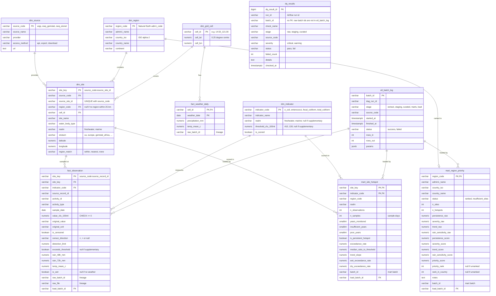

# Database Design (ERD)

**Owner:** DE2 · **Status:** Updated for STG-0 (natural keys) and MART-1 (mart columns). `sql/init/01_schema.sql` (DB-1) must match this exactly.

## Design notes

- **Natural keys everywhere.** `site_key`, `obs_key`, `region_code`, `cell_id`, `source_code`, `indicator_code` are built from the data itself, so every rerun produces the same keys. Loads use `INSERT ... ON CONFLICT (pk) DO UPDATE`, so reruns never duplicate rows (rerun safety).
- **Staging → warehouse.** `fact_observation` and `dim_site` carry the columns of `config/staging_schema.yaml` (observations, sites) plus curated additions: weather (`rain_48h_mm`, `rain_72h_mm`, `temp_mean_c`, `is_wet`) and `exceeds_threshold`.
- **Weather is copied onto observations** in the curated layer for analysis speed. `fact_weather_daily` stays the source of truth, reachable via `dim_site.cell_id` + date.
- **Marts** match `SITE_COLUMNS` / `REGION_COLUMNS` in `src/transform/marts.py` (MART-1), plus `load_batch_id` set by LOAD-1.
- **Supplementary indicators** (fecal, total coliform) are stored in `fact_observation` with `dim_indicator.is_scored = false` and never appear in the marts.
- **Lineage:** any curated row traces back through `raw_batch_id` + `raw_file` to the raw file and its manifest; `load_batch_id` → `etl_batch_log` shows which run loaded it.
- **`dq_results` has no FK to `etl_batch_log`** because raw batch ids come from the extractors, not from load runs.
